# Тут будут заметки по курсу

## 1.1. Введение
Автор курса имеет более 10 лет опыта программирования, имеет опыт преподавания.

### Задачи курса
- Получение практических навыков конфигурирования и программирования в системе 1СПредприятие 8
- Подготовка к сдаче экзамена 1СПрофессионал
- Подготовка к Т...

### Мотивационная речь
- Поменьше отвлекаться на плохие негативные новости, они будут понижать вашу эффективность
- Будет казаться что это не ваше, это нормально, мозг так борется с трудностями

## 1.2. Знакомство с системой 1СПредприятие
- Платформа
- Конфигурация
- Информационная база

Автор курса сравнивает 1СПредприятие с MS Excel.

**Фишка**: Использовать закладки в палитре свойств, для этого, ПКМ по политре свойств и ставим галочку на Закладками.

**Фишка**: Использовать форму поиска над деревом объектов конфигурации для поиска какого-то объекта, а не скроллить сто лет. Кстати в палитре свойств тоже есть форма поиска. 

Если в палитре свойств случайно нажать эту кнопку, то *неважные* свойства (по мнению платформы), будут скрыты:
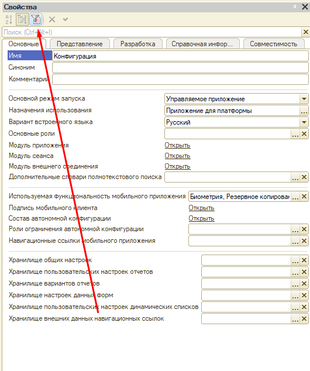

Ctrl + F5:
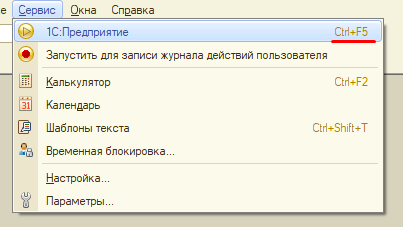

F7:
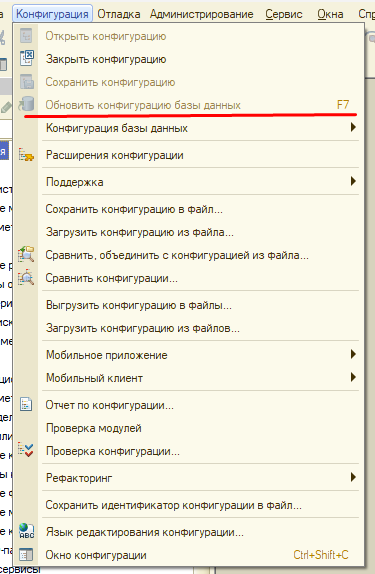

Конфигурация не изменилась:
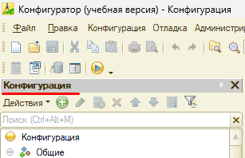

Конфигурация изменилась:
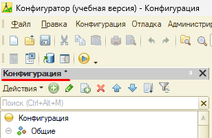

Конфигурация сохранена но конфигурация БД не обновлена:
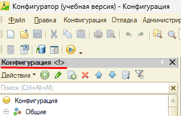

Устройство информационной базы:
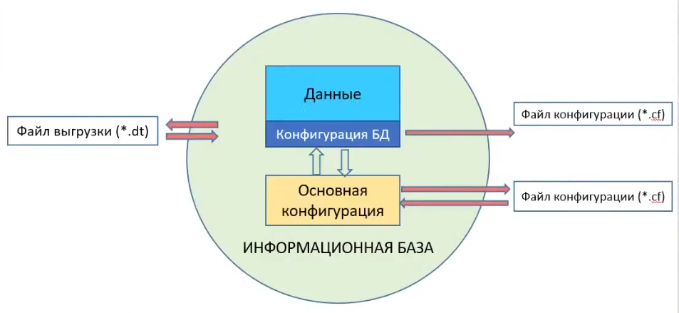

Основная конфигурация:
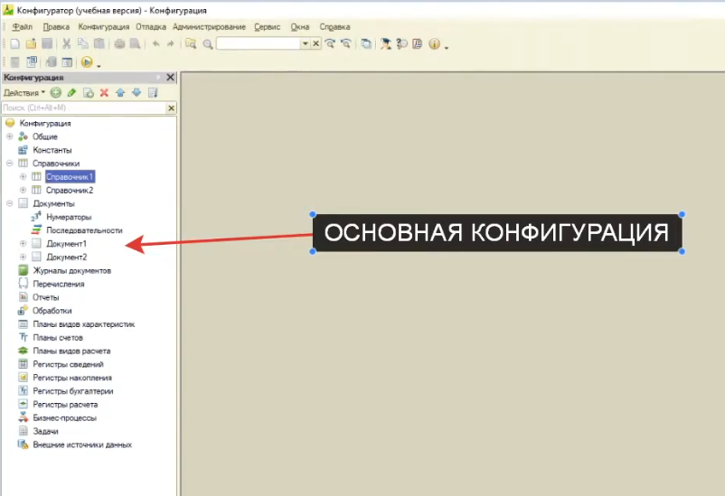

Конфигурация базы данных:
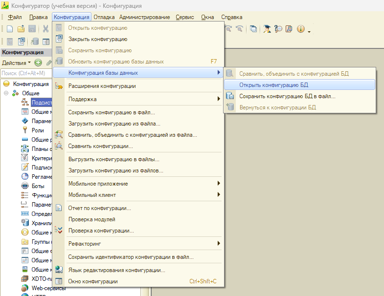

Конфигурация БД выглядит как основная конфигурация, но конфигурация БД доступна только для чтения:
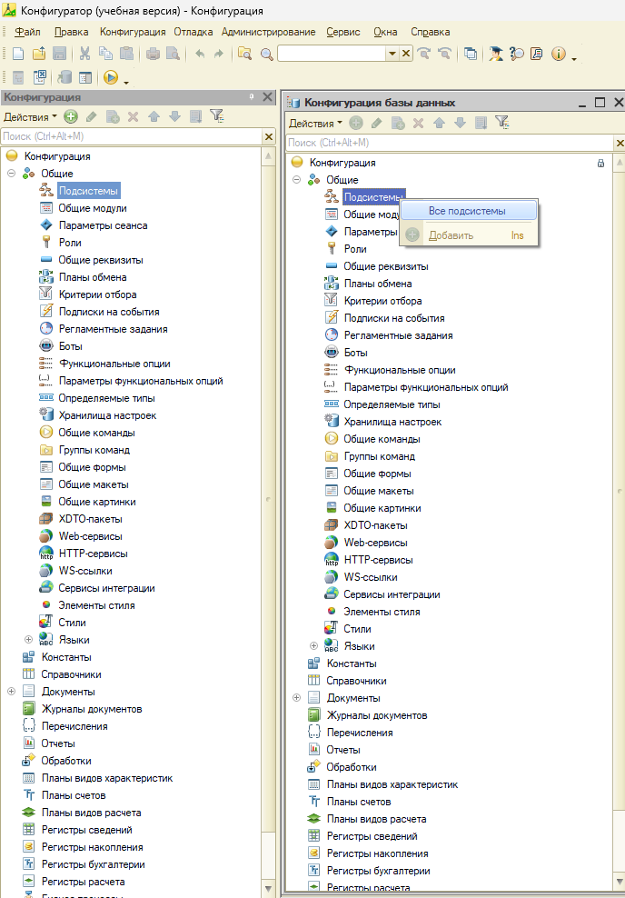

Давайте в основную конфигурацию добавим справочник, и увидим, что в конфигурации БД он не появился:
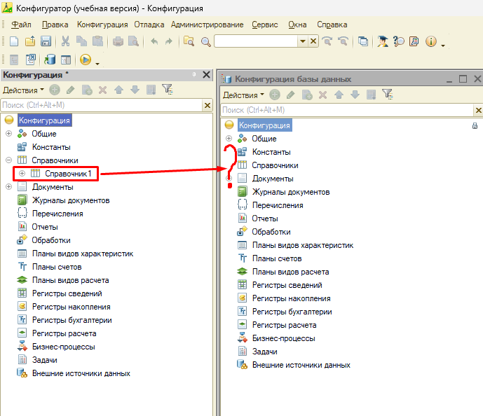

Все потому, что мы хоть и добавили Справочник1 в *основную конфигурацию*, но не обновили *конфигурацию БД*, если обновить конфигурацию БД (нажать F7), то Справочник1 появится в конфигурации БД, но перед этим необходимо сохранить изменения основной конфигурации (Ctrl+S):
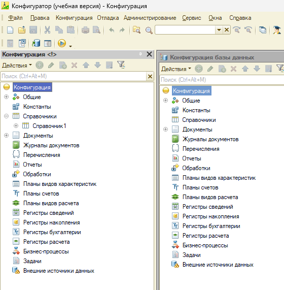

Обновление конфигурации БД (F7):
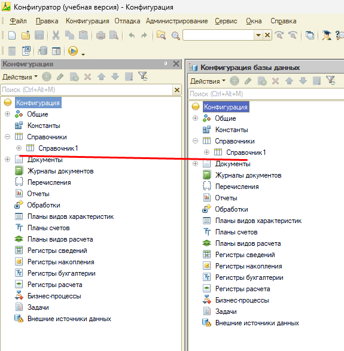
Как видно, справочник появился.

**Пользователь всегда работает с конфигурацией БД.**

Если вы случайно внесли изменения в основную конфигурацию и этого не нужно было делать, то можно вернуться к конфигурации БД:
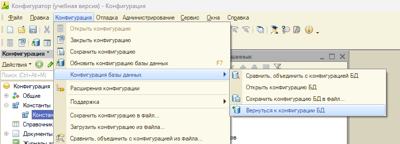

