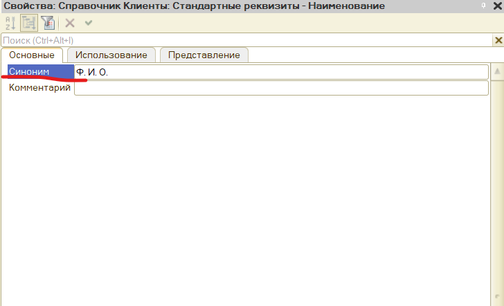

# Здесь будут заметки по книге: "Хрусталева, Радченко - 1С:Предприятие 8.3.22.1709 Практическое Пособие разработчика"

## Занятие 1 - Знакомство, создание информационной базы (контрольные вопросы).
*Вопрос*: Что такое конфигурируемость системы "1С:Предприятие"?

*Ответ*: Возможность настройки системы на особенности конкретного предприятия и класса решаемых задач.

*Вопрос*: Из каких основных частей состоит система?

*Ответ*: Конфигурация и Платформа.

*Вопрос*: Что такое платформа и что такое конфигурация?

*Ответ*: Платформа исполняет проектное решение описанное с помощью конфигурации, подобно проигрывателю который исполняет музыку записанную на DVD-дискете.

*Вопрос*: Для чего используется разные режимы запуска "1C:Предприятие"?

*Ответ*: Конфигуратор - для разработки проектного решения. Платформа - для исполнения конфигурации, с платформой взаимодействует пользователь. С конфигуратором взаимодействует разработчик.

*Вопрос*: Что такое дерево объектов конфигурации?

*Ответ*: Иерархическая структура состоящая из элементов проблемно-ориентированных бизнес-сущностей.

*Вопрос*: Что такое объекты конфигурации?

*Ответ*: Это объекты (детали, элементы) конфигурации, взаимосвязанное описание которых приводит к реализации какого либо проектного решения.

*Вопрос*: Что создает система на основе объектов конфигурации?

*Ответ*: Таблицы в БД.

*Вопрос*: Какими способами можно добавить новый объект конфигурации? 

*Ответ*: ПКМ по названию объекта конфигурации -> Добавить.

*Вопрос*: Зачем нужна палитра свойств?

*Ответ*: Палитра свойств позволяет редактировать все свойства объекта конфигурации и другую связанную с ним информацию.

*Вопрос*: Как запустить 1С:Предприятие в режиме отладки?

*Ответ*: F5.

## Занятие 2 - Подсистемы (контрольные вопросы).

*Вопрос*: Для чего используется объект конфигурации «Подсистема»?

*Ответ*: Для разделения проектного решения на логические разделы, к примеру мы можем разделить какое-то проектное решение на следующие подсистемы: расчет зарплаты, складской учет.

*Вопрос*: Как описать логическую структуру конфигурации при помощи объектов «Подсистема»?

*Ответ*: Выделить различные области объекта автоматизации (в данном случае предприятии) в отдельные Подсистемы

*Вопрос*: Как управлять порядком вывода и отображением подсистем в конфигурации?

*Ответ*: Выделить корень дерева объектов конфигурации -> ПКМ -> Открыть командный интерфейс конфигурации

*Вопрос*: Что такое окно редактирования объекта конфигурации и в чем его отличие от палитры свойств?

*Ответ*: Удобство последовательной настройки свойств объекта и закладки.

## Занятие 3 - Справочники (контрольные вопросы).

*Вопрос*: Для чего предназначен объект конфигурации «Справочник»?

*Ответ*: У каждого предприятия есть список каких-то элементов, которых нужно хранить. Структура и свойство этих элементов может быть описана в объекте конфигурации Справочник. Затем в этот Справочник, пользователь добавляет элементы. К примеру Справочник "Товары", может содержать в себе элементы "Телевизор", "Телефон", если, конечно, это предприятие продает бытовую технику.

*Вопрос*: Каковы характерные особенности справочника?

*Ответ*: Элементы справочника могут быть иерархическими, предопределенными. К примеру мы можем предопределить какой-то элемент в справочнике, чтобы пользователь случайно не мог удалить такой элемент справочника. Ведь как известно, пользователи могут добавлять и удалять элементы. Предопределенные элементы справочника удалять нельзя.

*Вопрос*: Для чего используются реквизиты и табличные части справочника?

*Ответ*: Каждый элемент справочника, как правило, содержит некоторую дополнительную информацию, которая подробнее описывает этот элемент. Например, все элементы справочника Товары могут содержать дополнительную информацию о производителе, сроке годности и др. Набор такой информации является одинаковым для всех элементов справочника, и для описания такого набора используются реквизиты объекта конфигурации Справочник, которые также, в свою очередь, являются объектами конфигурации. Реквизиты справочника подобны полям в таблицах БД. К примеру у таблицы "Пользователи" могут быть поля "Фамилия", "Имя", "Отчество". Так вот Фамилия", "Имя", "Отчество" - это реквизиты справочника "Пользователи".

*Вопрос*: Зачем нужны иерархические справочники и что такое родитель?

*Ответ*: Иерархические справочники - это такие справочники, в свойствах которых указана **Иерархический**. В таком случае можно создавать группы и элементы. Элементы можно перемещать в группы и в данном случае группа будет являться родителем.

*Вопрос*: Зачем нужны подчиненные справочники и что такое владелец?

*Ответ*: Элементы одного справочника могут быть подчинены элементам или группам другого справочника. Например, справочник КонтактныеЛица может быть подчинен справочнику Партнеры. Тогда для каждого партнера мы сможем указать его сотрудников, с которыми нужно контактировать. В системе «1С:Предприятие» это достигается путем указания списка владельцев справочника для каждого объекта конфигурации Справочник. В данном случае справочник Партнеры будет владельцем справочника КонтактныеЛица (рис. 3.7):

*Вопрос*: Какие основные формы существуют у справочника?

*Ответ*: У справочника есть несколько форм представления:

**Форма списка** — используется для просмотра данных, содержащихся в справочнике. Она позволяет выполнять навигацию по справочнику, добавлять, помечать на удаление и удалять элементы и группы справочника, перемещать элементы и группы.

**Форма элемента** — используется для просмотра и изменения данных отдельных элементов справочника. Как правило, она представляет данные в удобном для восприятия и редактирования виде.

**Форма группы** — отдельный вид формы для групп справочника.

**Форма выбора** — используется при различных действиях пользователя в прикладном решении, когда требуется выбрать конкретные элементы справочников.

**Форма выбора группы** — предназначена для выбора только среди групп, содержащихся в справочнике.

*Вопрос*: Что такое предопределенные элементы?

*Ответ*: Элементы Справочника которые созданы в режиме конфигуратора и могут участвовать в каких-то алгоритмах конфигурации, то есть они ценны для конфигуратора и не должны быть случайно удалены.

*Вопрос*: Чем с точки зрения конфигурации отличаются обычные элементы справочника от предопределенных элементов?

*Ответ*: Обычные справочники пользователь может удалить, обычные элементы не имеют ценности для интерпретатора, потому что они могут быть удалены пользователем или изменены. Предопределенные элементы не могут быть удалены пользователем. Они могут участвовать в каких-то алгоритмах конфигурации.

*Вопрос*: Как пользователь может отличить обычные элементы справочника от предопределенных элементов?

*Ответ*: У предопределенных элементов - специальная пиктограмма:

*Вопрос*: Как создать объект конфигурации «Справочник» и описать его структуру?

*Ответ*: В дереве объектов конфигурации, ПКМ по объекту конфигурации "Справочник" -> Добавить, далее открывается окно редактирования объекта конфигурации, где последовательно описывается структура объекта конфигурации Справочник.

*Вопрос*: Как задать синоним стандартного реквизита?

*Ответ*: Двойной клик по нужному справочнику -> Данные -> Стандартные Реквизиты -> Двойной клик по нужному реквизиту (открывается палитра свойств стандартного реквизита, где есть поле Синоним.):

*Вопрос*: Как добавить новые элементы в справочник?

*Ответ*: Если это предопределенный элемент, то в окне редактирования объекта конфигурации нужного справочника -> Прочее -> Предопределенные. Если это элемент который добавляется с пользовательского интерфейса, то в панеле функций текущего раздела выбрать справочник и нажать создать.

"Мы видим, что если перейти в раздел Оказание услуг или Бухгалтерия, то под панелью разделов появится панель функций текущего раздела (рис. 3.26). Панель функций текущего раздела содержит команды, соответствующие выделенному разделу. В начале панели расположены команды, позволяющие открыть какие-либо списки, а затем команды, позволяющие создать новые элементы данных, сформировать какой-нибудь отчет или выполнить обработку"

*Вопрос*: Как создать группу справочника?

*Ответ*: Чтобы была возможность создать группу справочника, при создании справочника на закладке **Иерархия** мы должны поставить галочку напроив пункта **Иерархический справочник**.

А чтобы создать группу, мы должны из панели функций текущего раздела, открыть форму списка справочника у которого есть свойство **Иерархический** и нажать на кнопку **Создать группу**.

*Вопрос*: Как переместить элементы из одной группы справочника в другую?

*Ответ*: Можно перетаскиванием, можно открыв форму элемента справочника и выбрать группу из выпадающего списка.

*Вопрос*: Зачем нужна основная конфигурация и конфигурация базы данных?

*Ответ*: С основной конфигурацией работает разработчик, с конфигурацией базы данных работает пользователь. Конфигурацию базы данных изменять будучи находясь в режиме конфигуратор - нельзя напрямую, то есть мы не можем в эту конфигурацию добавлять какие-то объекты непосредственно. Конфигурацию БД мы можем только обновить, внося изменения в основную конфигурацию.

*Вопрос*: Как изменить конфигурацию базы данных?

*Ответ*: Конфигурацию БД мы можем только обновить, внося изменения в основную конфигурацию.

*Вопрос*: Как связаны объекты конфигурации и объекты базы данных?

*Ответ*: Если сравнить в стиле ООП, то объект конфигурации - это базовый класс, а объекты БД - это экземпляры базового класса. То есть, есть шаблон описывающий какой-то объект и по образу и подобию данного объекта (шаблона) в БД создаются сущности и элементы данной сущности, точно соответствующие шаблону.

*Вопрос*: Что такое подчиненные объекты конфигурации?

*Ответ*: У разных объектов конфигурации есть также и подчиненные объекты конфигурации. Это те объекты, которые связаны и находятся иерархией (уровнем) ниже относительно какого-то объекта. К примеру у объекта конфигурации Справочник, есть объект конфигурации Реквизит. Они связаны, но объект конфигурации Реквизит не может существовать без Справочника, поэтому и подчиненный.

*Вопрос*: Зачем нужна проверка заполнения у реквизитов справочника?

*Ответ*: Чтобы не было пустых полей и нарушений целостности данных.

*Вопрос*: Что такое быстрый выбор и когда его использовать?

*Ответ*: Когда при создании элемента какого-либо справочника в форме элемента справочника, если какое-то поле является ссылочным, то открывался выпадающий список а не отдельное окно формы выбора.

*Вопрос*: Как отобразить справочник и определить его представление в различных разделах интерфейса приложения?

*Ответ*: Подсистемы -> ПКМ -> Все подсистемы

*Вопрос*: Как отобразить команды создания нового элемента справочника в интерфейсе подсистем?

*Ответ*: Подсистемы -> ПКМ -> Все подсистемы. В нужном разделе, в **Панель действий.Создать** выбрать команду и поставить галочку напротив.

*Вопрос*: Как редактировать командный интерфейс подсистем?

*Ответ*: Подсистемы -> ПКМ -> Все подсистемы

*Вопрос*: Какие стандартные панели используются в интерфейсе приложения и как выполнить настройку расположения этих панелей в конфигураторе и в режиме «1С:Предприятие»?

*Ответ*: ПКМ в корень объекта конфигурации - открыть командный интерфейс конфигурации или открыть командный интерфейс приложения.

## Занятие 4 - Документы (контрольные вопросы).

*Вопрос*: Для чего предназначен объект конфигурации «Документ»?

*Ответ*: Для фиксации совершенных хозяйственных операций и событий, произошедших в жизни предприятия. 

*Вопрос*: Какими характерными особенностями обладает документ?

*Ответ*: Документ обладает способностью проведения.

*Вопрос*: Для чего предназначены реквизиты и табличные части документа?

*Ответ*: Каждый документ, содержит инфу, которая описывает данный документ. К примеру документ Приходная накладная может содержать информацию о поставщике, товаров, складе, на который приходуется товар. Набор такой инфы является одинаковым для всех документов одного вида, и для описания такого набора используются реквизиты объекта конфигурации Документы. Кроме этого, каждый документ содержит, набор инфы которая одинакова по своей структуре, но предназначена для разных документов. Например, каждый документ Приходная накладная может содержать список приходуемых товаров. Для описания подобной инфы служат табличные части объекта конфигурации Документ.

*Вопрос*: Какие существуют основные формы документа?

*Ответ*: Форма документа, форма списка документа, форма выбора документа.

*Вопрос*: Что такое проведение документа?

*Ответ*: Факт проведения документа, ознаячает, что событие, которое он отраэает повлияло на состояние учета.

*Вопрос*: Как создать объект конфигурации «Документ» и описать его основную структуру?

*Ответ*: В дереве объектов конфигурации, выбрать ветку Документы и создать, задать имя, основные реквизиты.

*Вопрос*: Как создать новый документ и заполнить его данными?

*Ответ*: Зайти в раздел доступный для создания новых документов. Выполнить команду 'создать', откроется форма - заполнить.

*Вопрос*: Как создать собственную форму документа?

*Ответ*: Открываем окно редактирования объекта кофнигурации Документ конкретного документа. Переходим на закладку "Формы". Для того, чтобы создать форму документа, нажмем на кнопку открытия со значком лупы в поле ввода или кнопку Добавить над списком форм (рис. 4.17):

Система вызовет еще один полезный инструмент разработчика – конструктор формы (рис. 4.18).
Этот инструмент также построен по принципу «мастеров»: ввод данных в определенной последовательности и передвижение кнопками Далее и Назад.

Выберем тип формы Форма документа и нажмем кнопку Готово, согласившись тем самым со всем, что нам предложила система (см. рис. 4.18). Обратите внимание, что в дереве объектов конфигурации у объекта конфигурации Документ ПриходнаяНакладная появилась форма ФормаДокумента (рис. 4.19), а на экране открылось окно редактора форм, содержащее эту форму (рис. 4.20).

*Вопрос*: Что такое конструктор форм?

*Ответ*: Конструктор форм (Form Constructor) — это инструмент в платформе «1С:Предприятие 8», который позволяет создать необходимую форму для использования системой или для нужд разработчика при отображении данных объекта.

В Конструкторе формы есть возможность:

- выбрать основную форму;
- дать ей уникальное имя, синоним и комментарии;
- назначить специфическое поведение, исходя из назначения формы.

Конструктор форм даёт возможность визуально организовать создаваемую форму, сформировать список необходимых реквизитов, а также выбрать вариант размещения командной панели. В результате получается готовая форма с назначенными реквизитами и элементами.

*Вопрос*: Что такое редактор форм?

*Ответ*: Редактор форм объединяет несколько окон взаимосвязанных между собой редакторов.

*Вопрос*: Что такое элементы формы?

*Ответ*: Элементы из которых состоит форма, это могут быть поля ввода, кнопки и т.д.

*Вопрос*: Что такое события и с чем они связаны?

*Ответ*: События в данном контексте связаны ПриИзменении столбца Количество и Цены. Мы задали обработчики событий ПриИзменении столбцов Количество и Цены документов Приходная накладная и Оказание услуги.

*Вопрос*: Что такое обработчик события и как его создать?

*Ответ*: Обработчики событий это алгоритмы работы системы при взаимодействии с системой или исходя из ее состояния.

*Вопрос*: Что такое модуль и для чего он нужен?

*Ответ*: Модуль нужен для программирования, описания поведения объектов конфигурации.

*Вопрос*: Зачем нужны общие модули?

*Ответ*: Общие модули - это глобальные модули, все что определено в них - доступно везде.

*Вопрос*: Что такое типообразующие объекты?

*Ответ*: Это типы, которые не пристутствуют в конфигурации постоянно, а появляются в результате того, что добавлены некоторые объекты конфигурации. Например после того, как мы создали объект конфигурации Справочник Склады, сразу же появилось несколько новых типов данных, связанных с этим справочником. Среди них, например, СправочникСсылка.Склады. И если теперь мы укажем какому либо реквизиту этот тип данных, то сможем хранить в нем ссылку на конкретный объект справочника Склады. 
