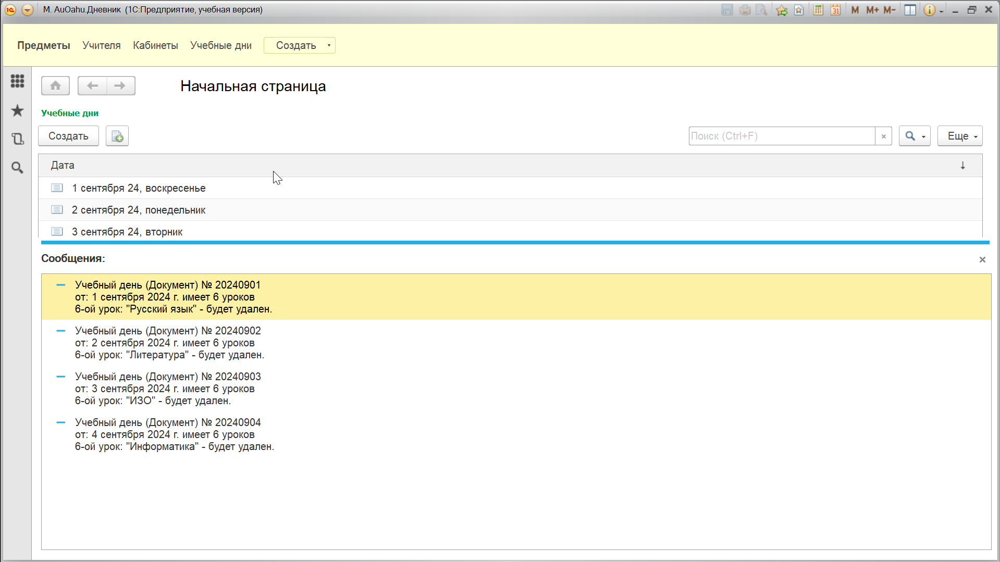

## Задание 3.49


В каждом документе *УчебныйДень* удалите последний урок. В каждом учебном дне должно остаться по 5 уроков. 
Для выполнения этого задания создайте новую процедуру в общем модуле *Серверный*. Перед запуском и проверкой своей программы запишите где-нибудь, какой урок должен оказаться последним в каждый из дней. Чтобы у вас была возможность проверить правильность работы.


```bsl
// Общие модули - Серверный

Процедура Удалить5Урок() Экспорт 
	Выборка = Документы.УчебныйДень.Выбрать();
	Пока Выборка.Следующий() Цикл
		ДокументОбъект = Выборка.ПолучитьОбъект();
		ДокументТабличнаяЧасть = ДокументОбъект.Уроки;
		Если ДокументТабличнаяЧасть.Количество() = 6 Тогда
			Сообщить(
			"Учебный день (Документ) № " + ДокументОбъект.Номер + "
			|от: " + Формат(ДокументОбъект.Дата, "ДЛФ=DD") + " имеет 6 уроков " + "
			|6-ой урок: " + """" + ДокументТабличнаяЧасть.Получить(5).Предмет + """" + " - будет удален."
			);			
			ДокументТабличнаяЧасть.Удалить(5);
			ДокументОбъект.Записать();
		КонецЕсли;
	КонецЦикла;
КонецПроцедуры
```

```bsl
// Модуль управляемого приложения

Процедура ПриНачалеРаботыСистемы()
	Серверный.Удалить5Урок();	
КонецПроцедуры
```


